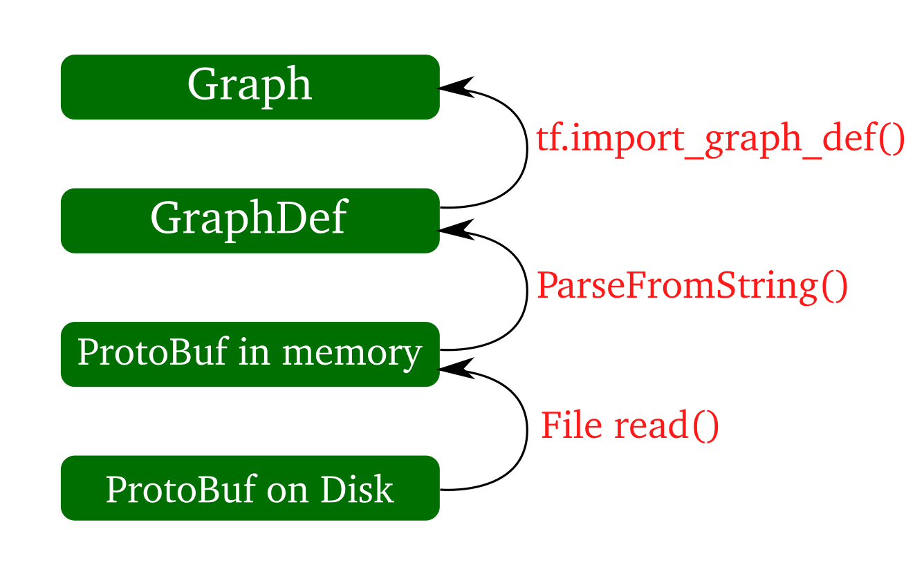

# How do you classify an image against a frozen TensorFlow model - Code Walk-Through of label_image.py 
By Hide Inada

# Goals
This article is a follow up on my previous article on transfer learning.
As I mentioned in that article, once you are done with re-training a model with your custom classes, you can use label_image.py to classify your image.  The model is called frozen as weight variables have been replaced with constants and you can no longer train this model.  However, it is good for prediction.

I thought it may be helpful to walk through the code for some readers as there are a few sections of the code that may not seem straightforward.

# Overall Structure
Overall structure of the code is the following:

1. Load the model
1. Load the class to label map file
1. Read an image file from the file system
1. Run the image through the model
1. Pick top 5 predicted classes

# 1. Loading the model
During the retraining, a model is saved as a [protobuf](https://developers.google.com/protocol-buffers/docs/pythontutorial) file on the file system.
In retrain.py, after the training is done, just before the model is saved, variables are replaced with constants using [tf.graph_util.convert_variables_to_constants](https://www.tensorflow.org/api_docs/python/tf/graph_util/convert_variables_to_constants) (_See. save_graph_to_file function in retrain.py_).  This makes sense as during prediction, you don't update weights any more so they don't have to be variables.

Reading the binary protobuf file is a four-step process.

1. Open the model file in the binary protobuf format
1. Read data into a buffer
1. Convert to GraphDef object from data
1. Convert to Graph object from GraphDef object

Here is the code:

```
def load_graph(model_file):
  graph = tf.Graph()
  graph_def = tf.GraphDef()

  with open(model_file, "rb") as f:
    graph_def.ParseFromString(f.read())
  with graph.as_default():
    tf.import_graph_def(graph_def)

  return graph
```

* graph_def.ParseFromString(f.read()) does step 2 and step 3.
* [tf.import_graph_def(graph_def)](https://www.tensorflow.org/api_docs/python/tf/graph_util/import_graph_def) does step 4.
* tf.import_graph_def(graph_def) restores nodes to the default graph so in this code, they are setting the graph
object to the default graph before calling tf.import_graph_def.



Restored nodes will have the prefix "import/" in their name.  You need to specify this when you refer to them.

graph_def.ParseFromString(f.read()) may look like this is a text operation, but it's not.
This is for binary.  [A TensorFlow documentation page](https://www.tensorflow.org/guide/extend/model_files) also mentions this.

# 2. Loading the class to label map file

By default, retrain.py writes a class ID to label mapping file to /tmp/output_labels.txt.

For example, if you open the file with 5 classes for animals, it should look like this:
```
bear
cat
dog
elephant
lion
```

bear maps to ID=0, cat maps to ID=1.

```

def load_labels(label_file):
  label = []
  proto_as_ascii_lines = tf.gfile.GFile(label_file).readlines()
  for l in proto_as_ascii_lines:
    label.append(l.rstrip())
  return label

```
You can consider [tf.gfile.Gfile](https://www.tensorflow.org/api_docs/python/tf/io/gfile/GFile) as an equivalent of a Python's open function.  The reference page discusses some benefits over using Python's IO, but I haven't had a chance to run a benchmark to verify.

# 3. Reading an image file from the file system
This part is straightforward.
The below code just opens an image file in the bmp, gif, png or jpg format and reads the file.

Input image dimension is set to 299 by 299 pixels for Inception-v3 model.

Here are the things that happen:

* Add an operation to open and read the image file to the buffer
* Decode the data as png, gif, bmp or jpeg based on the file extension
* Cast the uint8 data to float32 to prepare for the range conversion later
* Add one more dimension in axis 0. For example, if the original image has a dimension 1024x800x3, it will become 1x1024x800x3
* Resize image 1x299x299x3 to using [bilinear interpolation](https://en.wikipedia.org/wiki/Bilinear_interpolation).
* Normalize data. By default, shift the value from 0-255 to 0-1
* Run the session to actually read the data and return in a numpy ndarray.

```
def read_tensor_from_image_file(file_name,
                                input_height=299,
                                input_width=299,
                                input_mean=0,
                                input_std=255):
  input_name = "file_reader"
  output_name = "normalized"
  file_reader = tf.read_file(file_name, input_name)
  if file_name.endswith(".png"):
    image_reader = tf.image.decode_png(
        file_reader, channels=3, name="png_reader")
  elif file_name.endswith(".gif"):
    image_reader = tf.squeeze(
        tf.image.decode_gif(file_reader, name="gif_reader"))
  elif file_name.endswith(".bmp"):
    image_reader = tf.image.decode_bmp(file_reader, name="bmp_reader")
  else:
    image_reader = tf.image.decode_jpeg(
        file_reader, channels=3, name="jpeg_reader")
  float_caster = tf.cast(image_reader, tf.float32)
  dims_expander = tf.expand_dims(float_caster, 0)
  resized = tf.image.resize_bilinear(dims_expander, [input_height, input_width])
  normalized = tf.divide(tf.subtract(resized, [input_mean]), [input_std])
  sess = tf.Session()
  result = sess.run(normalized)

  return result
```
Note [tf.read_file](https://www.tensorflow.org/api_docs/python/tf/io/read_file) does not return the content upon
invocation.  It returns a string Tensor.  Actual evaluation is done in sess.run() just like any other tensors.

# 4. Running the image through the model

Once the model is loaded and the image file is read, you can run the image through the model.
In order to do that you need to :

* know the name of the node in the graph.
* get the reference to the node

Input layer's name was set to Placeholder in retrain.py and you specified this when you run label_image.py. 
Since import namespace is added, the name is _import/Placeholder_. Output layer's name is _import/final_result_.

tfGraph.get_operation_by_name() method returns a reference to the graph, which is called an operation
in TensorFlow terminology, so calling the method once for input and output, input_operation and output_operation
will contain a reference to input and output nodes.

To fetch a value using [tf.Session.run](https://www.tensorflow.org/api_docs/python/tf/Session), you specify a tensor in fetches and feed_dict arguments.
To get to the tensor holding the image data value associated with the Placeholder node, you can specify the member variable called _outputs_ of the node. This variable is a Python list, and the actual tensor for image data corresponds to the first element of the list.
so you put input_operation.outputs[0] as the feed dict key.

Similarly, output_operation.outputs[0] contains the tensor named "input/final_result:0" to be fetched to return the value of predicted result.

Once the result is returned, it is in an ndarray with the shape (1, number of classes) with 1 indicating that the batch size was 1.  For example, if you have 10 classes, the shape will be (1, 10).
You want to change this to be a 1-dimensional array by getting rid of the first axis which is for the batch size, so you need to call np.squeeze().

```

  graph = load_graph(model_file)
  t = read_tensor_from_image_file(
      file_name,
      input_height=input_height,
      input_width=input_width,
      input_mean=input_mean,
      input_std=input_std)

  input_name = "import/" + input_layer
  output_name = "import/" + output_layer
  input_operation = graph.get_operation_by_name(input_name)
  output_operation = graph.get_operation_by_name(output_name)

  with tf.Session(graph=graph) as sess:
    results = sess.run(output_operation.outputs[0], {
        input_operation.outputs[0]: t
    })
  results = np.squeeze(results)
```

# 5. Picking top 5 from the predicted result
If you have 5 classes, the result array contains something like this.

```
0.001
0.600
0.002
0.300
0.098
```

If we combine this with the label and class ID for each label, you will get:

| Probability | label | class ID |
|---|---|---|
| 0.001 | bear | 0 |
| 0.600 | lion | 1 |
| 0.002 | elephant | 2 |
| 0.300 | cat | 3 |
| 0.098 | dog | 4 |

In this case, you want to pick top 3 based on the probability, so the final result you want to get is this:

| Probability | label | class ID |
|---|---|---|
| 0.600 | lion | 1 |
| 0.300 | cat | 3 |
| 0.098 | dog | 4 |

Let's figure out how we can do this from the original 5 element array step by step:

First, you want to sort the class IDs by the probability.
In numpy, there is a function called argsort which sorts indices based on the value each index points to.
argsort sorts an array by ascending order, and returns the original index for each number.

Let's take a look at a simple example:
```
>>> a = np.array([10, 1, 5])
>>> type(a)
<class 'numpy.ndarray'>
>>> b = a.argsort()
>>> b
array([1, 2, 0])
```

In this case, in the array 'a', 1 is the smallest number with the index 1.
Next small number is 5 at index 2, the least small number is 10 at index 0, so argsort returns 1, 2, 0.

Applying this to our example, class ID is the same as the index into the array.  Therefore if you sort the indices by the probability value, we will get:

| Probability | label | class ID |
|---|---|---|
| 0.001 | bear | 0 |
| 0.002 | elephant | 2 |
| 0.098 | dog | 4 |
| 0.300 | cat | 3 |
| 0.600 | lion | 1 |

(In actual code, you get only the array of index like below so you'll see, but I'm providing the values in a table for clarity.)
```
0
2
4
3
1
```

Since you are interested in the top 3, you pick the last 3 entries :

| Probability | label | class ID |
|---|---|---|
| 0.098 | dog | 4 |
| 0.300 | cat | 3 |
| 0.600 | lion | 1 |

Finally, you need to reverse the sequence to get:
1
3
4

These two actions are done in 

```
  top_k = results.argsort()[-5:][::-1]
```

[-5:] corresponds to pick the last 5 items in the asending list.
[::-1] correspoinds to reverse the top 5 list.


For example,
```
>>> a = np.array([1, 2, 3, 4, 5])
>>> b = a[-3:]
>>> b
array([3, 4, 5])
>>> c = b[::-1]
>>> c
array([5, 4, 3])
```

Once you get the indices which again are the same as class IDs in this case for top 5 result, you show the label and probability for each class ID using the following code:
```

  top_k = results.argsort()[-5:][::-1]
  labels = load_labels(label_file)
  for i in top_k:
    print(labels[i], results[i])

```

# Final words
Hopefully this short walk-through will help you better understand what is happening in label_image.py so that you can leverage this code for your own application.  If you have any feedback, please feel free to reach out to me.

<hr>

# License

This is the license for the code that appears in this article:

```
# Copyright 2017 The TensorFlow Authors. All Rights Reserved.
#
# Licensed under the Apache License, Version 2.0 (the "License");
# you may not use this file except in compliance with the License.
# You may obtain a copy of the License at
#
#     http://www.apache.org/licenses/LICENSE-2.0
#
# Unless required by applicable law or agreed to in writing, software
# distributed under the License is distributed on an "AS IS" BASIS,
# WITHOUT WARRANTIES OR CONDITIONS OF ANY KIND, either express or implied.
# See the License for the specific language governing permissions and
# limitations under the License.
# ==============================================================================
```
