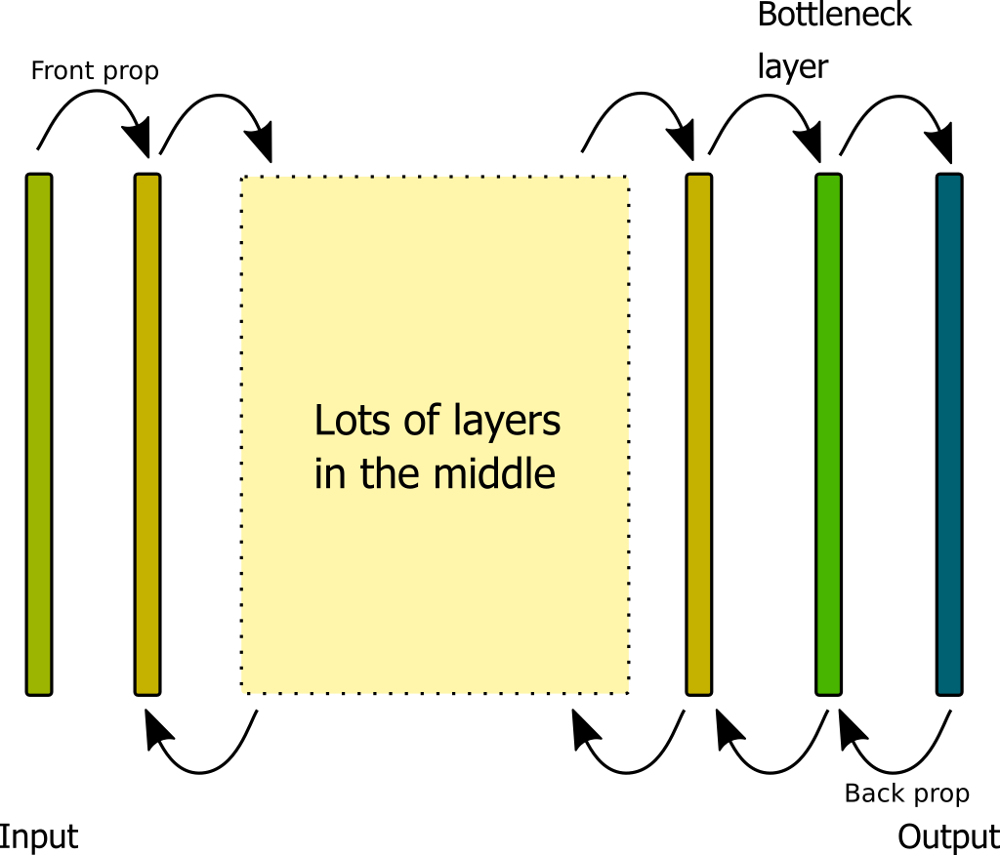
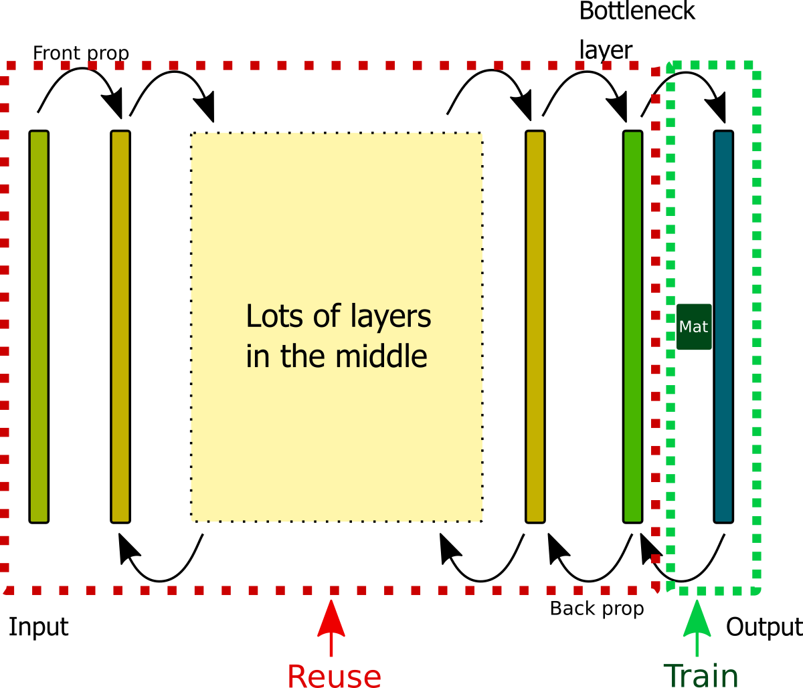
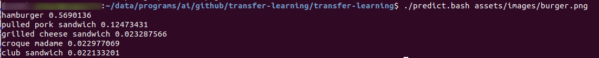
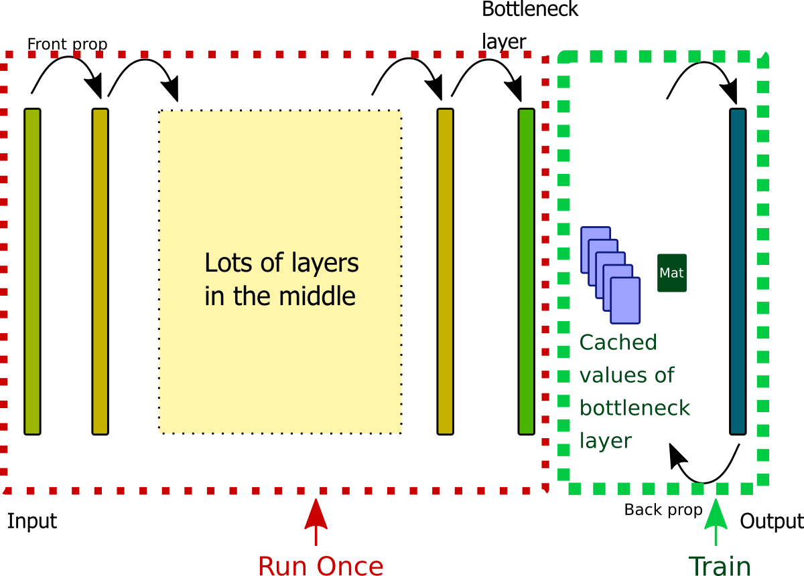

# Transfer Learning - How to leverage a pre-trained model to speed up training for machine learning
<div style="text-align:right">By Hide Inada</div>

## Problem statement
Imagine you are a machine learning engineer working for a photo sharing website.
One morning, your manager comes to you and asks you to develop a feature that classifies food images into categories so that your company's website can show nearby restaurants that serve food in the category of the photo on the page. This would raise ad revenue from restaurants.  Here is a mock up of the page that the manager showed you:


In this example, a local burger joint's ad is displayed on the right after your ML code classifies the photo as a burger.  Since you are not a front-end engineer, as long as you return the burger class, presentation will be taken care of by another team. 

The problem is that your manager's manager is new to the company. He does not really know much about machine learning, but really wants this feature now to impress his new boss that he knows AI.  Unfortunately, your manager does not have  experience in machine learning, so he doesn't really know how long a machine learning project can take, so he didn't think to ask for more time.  He assumed that somehow this can be done easily by you.

He said: _"It shouldn' be that difficult for you, right!"_


You want to train at least tens of thousands of images which can take days.  Not only that, you are not really sure about hyperparameter settings, so tuning can multiply the time required for training.  On top of that, you don't even know if your company has the powerful enough hardware to do this training fast enough.  You remember that when you asked for NVIDIA DGX-1 and told your manager a price, your manager was so shocked and burst out coffee all over your desk.

After you explained all these challenges to him, he looked surprised and finally realized that it's not as easy as he thinks it is.  However, he doesn't want to renegotiate the timeline with his manager, so now he is asking you if there is anyway you can come up with something.

Aside from recommending to your manager that your manager and your manager's manager should take the Management 101 class, is there anything you can do to meet this crazy deadline?

Yes, possibly.  Transfer training may work for you.

<hr>
This article consists of three parts:
In the first part, I will discuss the concept of transfer learning.  In the second part, I will go over the actual steps to train your model and predict using transfer learning.  In the third part, I will walk you through retrain.py which is a script the TensorFlow team provided for transfer learning.  I hope this will help you customize the script if needed, or apply knowledge for your future project that requires transfer learning.

## Disclaimer
If you decide to use any product or dataset mentioned in this article, it is your responsibility to verify that your use is in compliance with the license terms of each product and/or dataset.  

<hr>

## 1. Concept
It takes significant machine resources and time to train the model especially when there are so many layers.  For example, Inception-v3 has 42 layers [1].  However, there is a way to short circuit the training process. This is called transfer learning.
Shown below is a conventional network architecture:



Input to the network propagates layer by layer all the way to the output layer.
Once loss is calculated, gradient of the loss is propagated all the way back to the first layer after the input.  In the back propagation process, weights for each layer is recalculated.

This training process is done in a loop, and iterations continue until the loss becomes reasonably small. Since there are a lot of calculations involved, the process can take days or even longer.

In transfer learning, instead of training the model from scratch, you reuse the model that was already trained.  Most likely, you will be using the model, which has been trained by someone else with adequate hardware resources.

In the below diagram, red dotted line shows the part that can be reused.



This works based on the assumption that a deep neural network is trained to extract features in various layers.
If you go all the way up to the layer one before the output layer, which is called the bottleneck layer by the TensorFlow team, feature extraction is already done and that last layer's responsibility is to map extracted features in the bottleneck layer to a set of classes for your images on the output layer.

So what exactly does train the last output layer mean?
If the bottleneck layer is a plain-vanilla neural network layer (aka dense layer or a fully connected layer), then there is a matrix and a set of weights to be added as biases.  So you will be training these two unless you decide to add something extra.  In the diagram above, a green box with "Mat" indicates this matrix.  Biases are not shown in the diagram.

So in summary what you need is:
1. A model with pre-trained weights
1. A new layer with a matrix and biases to classify your images

For the first one, the good news is that the TensorFlow team has made various pre-trained models available for this on their website called TensorFlow Hub.

For the second one, they also made a script called "retrain.py" available to automate the creation and training of this new layer. This script also automatically downloads the pre-trained weights to your computer, so pretty much what you need to do is just the following two steps:

1) Set up a dataset with images on your file system
2) Run retrain.py

The whole training process can be done in 1 hour depending on how large your dataset is!

# 2. Steps to train the model
In this section, I will go over details of the two high-level steps.

## 2.1. Set up the dataset on your file system
retrain.py expects that image data is stored in a multi-level directory structure.  Here is the two-level directory structure that I recommend:

```
top image directory
--- image category label 1
------ jpeg files in that category 1
------ jpeg file in that category 1
------ jpeg file in that category 1
...

--- image category label 2
------ jpeg file in that category 2
------ jpeg file in that category 2
------ jpeg file in that category 2
...
```

For example,
```
food_images
--- burrito
------ burrito1.jpg
------ burrito2.jpg
...

--- sushi
------ sushi1.jpg
------ sushi2.jpg
...
```

Each image directory name is used as the class label of the images in the directory.
retrain.py automatically splits validation and test set images from the training set, so there is no need for you to separate images if you want to avoid extra work.

You can use any dataset that you want, but I used Food-101 dataset.  Please see the below page if you want to use this dataset: https://github.com/hideyukiinada/transfer-learning/blob/master/food101.md

## 2.2. Training using retrain.py
Once the images were laid out on your file system, you can clone this repo to download:
* retrain.py
* label_img.py

retrain.py and label_img.py were developed by the TensorFlow team and licensed under the terms listed at the top of each file.

If you want to check for the newer version, you can check hub and tensorflow repos:
```
git clone https://github.com/tensorflow/hub
diff hub/examples/image_training/retrain.py <path to this retrain.py>
```

```
git clone https://github.com/tensorflow/tensorflow
diff tensorflow/tensorflow/examples/label_image/label_image.py <path to this label_img.py>
```

Once you have retrain.py on your local disk, run it with the name of the top-level image directory specified in the --image_dir option.
For example, if your images are located under food_images, type: 

```
python retrain.py --image_dir=food_images
```

If you clone this repo, you can also use my wrapper called train.bash
```
#!/bin/bash

# Replace the directory name after the --image_dir

export TFHUB_CACHE_DIR=/tmp/food101/module_cache

time python retrain.py --image_dir=../../../dataset/food101/food-101/images

```

Just edit the image_dir path and run it.  You can also change the TFHUB_CACHE_DIR environment variable to store the module file in a different directory.

This starts the training session.

When the script is completed, verify the output in the following directories:

* /tmp/output_labels.txt
* /tmp/output_graph.pb

output_labels.txt contains the classes of your images which were taken from each directory.
output_graph.pb is the new model file with trained weight in the protobuf format.  You will be using these files for prediction in the next step.

## 2.3. Predict

You can use predict.bash if you cloned this repo. It's a wrapper that calls label_image.py with the set of parameters:
```
#!/bin/bash

python label_image.py \
--graph=/tmp/output_graph.pb \
--labels=/tmp/output_labels.txt \
--input_layer=Placeholder \
--output_layer=final_result \
--image=$1 2>/dev/null
```

For example, if you want to predict the class for the image, burger.jpg, type:

```
./predict.bash burger.jpg
```

Here is the actual result against the image at the top of this article:



# 3. Inside retrain.py
## 3.1. License
As I am going over some part of the code, here is the license for the code by the TensorFlow team:
```
# Copyright 2015 The TensorFlow Authors. All Rights Reserved.
#
# Licensed under the Apache License, Version 2.0 (the "License");
# you may not use this file except in compliance with the License.
# You may obtain a copy of the License at
#
#     http://www.apache.org/licenses/LICENSE-2.0
#
# Unless required by applicable law or agreed to in writing, software
# distributed under the License is distributed on an "AS IS" BASIS,
# WITHOUT WARRANTIES OR CONDITIONS OF ANY KIND, either express or implied.
# See the License for the specific language governing permissions and
# limitations under the License.
# ==============================================================================
# NOTICE: This work was derived from tensorflow/examples/image_retraining
# and modified to use TensorFlow Hub modules.
```

## 3.2. Terminology 
TensorFlow team uses the word "module" to mean "a self-contained piece of a TensorFlow graph, along with its weights" &#91;3&#93;.  In this section, I will be following that convention.

## 3.3. Overview of high-level items
Here are the main items that are done in the script. Shown in parentheses are the name of the functions that correspond to the task:
1. Check for command line arguments
1. Clean up TensorBoard log directory and ensure it exists (prepare_file_system())
1. Ensure a directory to store an intermediate graph exists if store frequency is specified as greater than 0 (prepare_file_system())
1. Read the image directory and subdirectories, get the list of JPEG files in each subdirectory and split the set of files into training, validation, test sets per the ratio specified in command line arguments (create_image_lists()). Logic to split the dataset is to calculate the hash value of each file name.  Each hash is converted to an int and gets mapped to the 0-100 range to compare against validation and test set ratios specified in command line.
1. Determine if any command line argument is specified for data augmentation (should_distort_images())
1. Unless found in local cache already, download the module files from the TensorFlow Hub website.  Instantiate ModuleSpec with the downloaded model and path to the downloaded weights ((hub.load_module_spec())).  _See atomic_download() defined in tensorflow_hub/resolver.py for downloading details._ 
1. Instantiate the Module object from ModuleSpec and get the last layer of the module (create_module_graph())
1. Add the output layer to classify your custom dataset (add_final_retrain_ops())
1. Add operations to resize the JPEG data to the size that the module expects (add_jpeg_decoding())
1. If any data augmentation option is specified on the command line, crop, flip horizontally and/or adjust brightness of the image (add_input_distortions)
1. If data augmentation option was not specified, forward propagate the image data through the network all the way up to the bottleneck layer and writes the values to the file system (cache_bottlenecks)
1. Add operations to calculate accuracy by comparing predictions and ground-truth and taking the mean (add_evaluation_step())
1. Consolidate stats that you want to show in TensorBoard and direct the stats log output to the file system by instantiating FileWriter objects
1. Instantiate tf.train.Saver to prepare for saving weights during training
1. Train by repeating the following steps:
    1. If data augmentation is specified, read each image file from the file system, apply data augmentation, feed forward to the bottleneck layer (get_random_distorted_bottlenecks())
    2. If not, read the cached bottleneck layer values for each image from the file system (get_random_cached_bottlenecks) 
    3. Feed the bottleneck values and the ground-truth to the graph and optimize by using gradient descent as defined in add_final_retrain_ops
    4. On the pre-determined interval, calculation training accuracy and validation accuracy
    5. On the pre-determined interval, save intermediate graph and weights
1. Once the training is done, save weights
1. Predict against the test set to measure accuracy (run_final_eval())
1. Serialize the graph and save to the file system (save_graph_to_file())
1. If specified in command line, save labels to the file system
1. If specified in command line, save the model to be served with [TensorFlow serving](https://www.tensorflow.org/tfx/serving/) (export_model()). Note that this function is using now deprecated [tf.saved_model.simple_save () function](https://www.tensorflow.org/api_docs/python/tf/saved_model/simple_save), so you may want to update in the future.

## 3.4. Module
By default, a default module to be downloaded and re-trained is set to https://tfhub.dev/google/imagenet/inception_v3/feature_vector/1.  
This can be overridden with the --tfhub_module argument:

```
  parser.add_argument(
      '--tfhub_module',
      type=str,
      default=(
          'https://tfhub.dev/google/imagenet/inception_v3/feature_vector/1'),
      help="""\
      Which TensorFlow Hub module to use. For more options,
      search https://tfhub.dev for image feature vector modules.\
      """)
```

[TensorFlow Hub website](https://tfhub.dev/) provides various modules for you to re-train if you want to try other modules.

Before calling retrain.py, I specified the TFHUB module cache directory in the script:
```
export TFHUB_CACHE_DIR=/tmp/food101/module_cache
```

In tensorflow_hub/resolver.py, there is a function called tfhub_cache_dir(), and this retrieves the name of the cache directory from this environment variable if defined. (You will find this file under your virtualenv's site-packages directory if you are using virtualenv).


Once the script is run, the /tmp/food101/module_cache will contain:

```
/tmp/food101/module_cache/11d9faf945d073033780fd924b2b09ff42155763
/tmp/food101/module_cache/11d9faf945d073033780fd924b2b09ff42155763/variables
/tmp/food101/module_cache/11d9faf945d073033780fd924b2b09ff42155763/variables/variables.index
/tmp/food101/module_cache/11d9faf945d073033780fd924b2b09ff42155763/variables/variables.data-00000-of-00001
/tmp/food101/module_cache/11d9faf945d073033780fd924b2b09ff42155763/assets
/tmp/food101/module_cache/11d9faf945d073033780fd924b2b09ff42155763/saved_model.pb
/tmp/food101/module_cache/11d9faf945d073033780fd924b2b09ff42155763/tfhub_module.pb
/tmp/food101/module_cache/11d9faf945d073033780fd924b2b09ff42155763.descriptor.txt

```

## 3.5. Forward propagation
It may not be clear from the overview of the steps but what retrain.py does is clever in terms of forward propagation.
It splits forward propagation to two phases:

The first part is to calculate the bottleneck layer values of each image.  Unless you are using data augmentation, this is done only once for the script execution in a function run_bottleneck_on_image().  The values are cached on the file system.



The second part is to use these values as the input to a dense layer neural network and train.  This is shown in the green box.
Since you will be only updating the weights for the last layer in a loop, this is a huge time saver.

## 3.6 Matrix and biases definition for the last layer

A matrix and biases for the last layer are defined add_final_retrain_ops():

```
  layer_name = 'final_retrain_ops'
  with tf.name_scope(layer_name):
    with tf.name_scope('weights'):
      initial_value = tf.truncated_normal(
          [bottleneck_tensor_size, class_count], stddev=0.001)
      layer_weights = tf.Variable(initial_value, name='final_weights')
      variable_summaries(layer_weights)

    with tf.name_scope('biases'):
      layer_biases = tf.Variable(tf.zeros([class_count]), name='final_biases')
      variable_summaries(layer_biases)

    with tf.name_scope('Wx_plus_b'):
      logits = tf.matmul(bottleneck_input, layer_weights) + layer_biases
      tf.summary.histogram('pre_activations', logits)

  final_tensor = tf.nn.softmax(logits, name=final_tensor_name)
```

As you can see, this is a very straightforward operation.

# 4. Final words
Hopefully, this article will help you with your classification task in the future.  If you have any feedback, please feel free to reach out to me.

# References
&#91;1&#93; Christian Szegedy et al. Rethinking the Inception Architecture for Computer Vision. https://www.cv-foundation.org/openaccess/content_cvpr_2016/papers/Szegedy_Rethinking_the_Inception_CVPR_2016_paper.pdf, 2016.

&#91;2&#93; TensorFlow team. How to Retrain an Image Classifier for New Categories. https://www.tensorflow.org/hub/tutorials/image_retraining.

&#91;3&#93;  Josh Gordon. Introducing TensorFlow Hub: A Library for Reusable Machine Learning Modules in TensorFlow. https://medium.com/tensorflow/introducing-tensorflow-hub-a-library-for-reusable-machine-learning-modules-in-tensorflow-cdee41fa18f9, 2018.

